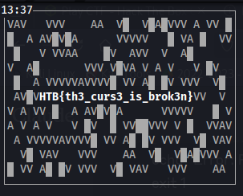

# Impossimaze Writeup

## Challenge Overview
- **Name**: Impossimaze
- **Difficulty**: Medium
- **Category**: Reverse Engineering / Exploitation

## Initial Analysis

### Challenge Description
The challenge presents a seemingly simple ncurses-based program where the player navigates through a maze-like interface. The goal is to uncover a hidden flag by understanding the program's intricate mechanics.

### Key Observations
1. The program uses ncurses library for terminal-based interaction
2. Allows movement using arrow keys
3. Displays terminal dimensions
4. Contains a specific hidden mechanism when terminal is exactly 13x37

## Reverse Engineering Approach

### Code Breakdown
The main function reveals several interesting characteristics:
- Uses `initscr()`, `cbreak()`, `noecho()` for terminal setup
- Implements custom movement logic
- Contains a special rendering mechanism based on coordinates
- Triggers a specific code path when terminal is 13x37

### Movement Mechanics
- Left Arrow (260): Decrease x-coordinate
- Right Arrow (261): Increase x-coordinate
- Up Arrow (259): Decrease y-coordinate
- Down Arrow (258): Increase y-coordinate
- Cursor represented by 'X' character

### Flag Reveal Mechanism
The critical part is the conditional block:
```c
if ( v9 == 13 && v14 == 37 )
{
    // Special flag rendering logic
}
```

This indicates that the flag is only revealed when:
- Terminal height is exactly 13 rows
- Terminal width is exactly 37 columns

### Exploitation Strategy
1. Modify terminal size to exactly 13x37
2. Run the program
3. Observe hidden flag rendering

## Solution Script
```bash
#!/bin/bash
PROGRAM="./main"

# Set precise terminal size
stty rows 13 cols 37

# Execute program
"$PROGRAM"
```

## Flag
`HTB{th3_curs3_is_brok3n}`


and :
